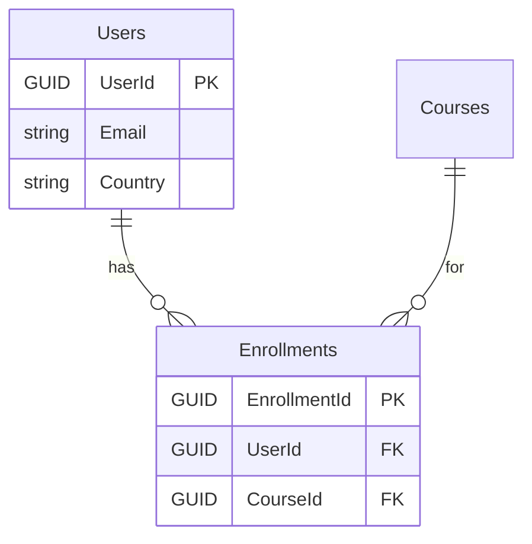
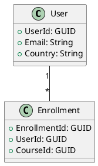
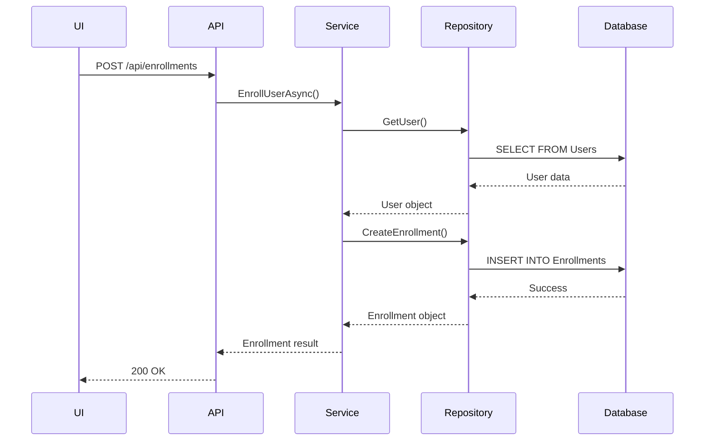

# GitHub Copilot Spaces: Technical Reference Guide
## File Types, Context Capabilities & Limitations

**Last Updated**: November 7, 2025  
**Audience**: Technical Team - Training Tracker Project  
**Purpose**: Technical reference for understanding what Copilot Spaces can and cannot do

---

## Table of Contents
1. [What Copilot Spaces Can Read & Interpret](#what-copilot-spaces-can-read--interpret)
2. [File Type Support Matrix](#file-type-support-matrix)
3. [Context Ranking & Prioritization](#context-ranking--prioritization)
4. [Critical Limitations](#critical-limitations)
5. [Cross-Repository Intelligence Analysis](#cross-repository-intelligence-analysis)
6. [Best Practices for Maximizing Spaces Effectiveness](#best-practices)

---

## What Copilot Spaces Can Read & Interpret

### ✅ Fully Supported File Types

#### 1. Code Files (Primary Context)
```
✅ Source code: .cs, .js, .ts, .py, .java, .go, .rb, .php, .cpp, .c
✅ Web: .html, .css, .scss, .sass, .vue, .jsx, .tsx, .svelte
✅ Config: .json, .yaml, .yml, .xml, .toml, .ini
✅ Scripts: .sh, .bash, .bat, .ps1, .sql
✅ Build: Dockerfile, .gitignore, package.json, requirements.txt, pom.xml
```

**What Spaces Does**:
- Parses syntax and structure
- Understands relationships (imports, dependencies)
- Indexes functions, classes, methods
- Maps cross-file references

**Example Use Case**:
```
Space includes: EnrollmentService.cs + EnrollmentRepository.cs + Enrollments_doc.md

Prompt: "What database tables does EnrollmentService access?"

Result: ✅ Spaces correctly links service → repository → Enrollments table
        (Accuracy: 70-85% for well-structured code)
```

---

#### 2. Markdown Documentation (High Value)
```
✅ .md, .markdown files
✅ README.md, CHANGELOG.md, API.md, ARCHITECTURE.md
✅ AKR Charter files, table docs, service docs
✅ Feature documentation, runbooks, ADRs (Architecture Decision Records)
```

**What Spaces Does**:
- Full text indexing
- Extracts headings, lists, code blocks
- Links markdown files to related code
- Understands document structure (H1 > H2 > H3)

**Example Use Case**:
```
Space includes: table_doc_template.md + Users_doc.md + EnrollmentService_doc.md

Prompt: "Generate documentation for CourseService using AKR standards"

Result: ✅ Spaces follows template structure, applies BR-XXX-### format
        (Quality depends on template clarity)
```

---

#### 3. Plain Text Files
```
✅ .txt files (release notes, logs, requirements)
✅ .log files (error logs, audit trails) - limited interpretation
✅ .env.example (configuration examples)
✅ .csv, .tsv (readable as text, but no table operations)
```

**What Spaces Does**:
- Full text search
- Basic context understanding
- Less structured than Markdown (lower priority in context ranking)

---

### ⚠️ Partially Supported File Types

#### 1. Office Documents (LIMITED - NOT RECOMMENDED)
```
⚠️ .docx, .xlsx, .pptx - NOT directly readable
   - Spaces cannot read Office binary formats
   - Must convert to .md or .txt first
   - Formatting, tables, and structure lost
```

**Workaround**:
```bash
# Convert Word docs → Markdown using Pandoc
pandoc requirements.docx -o requirements.md

# Or manually copy-paste to .md
# Or use GitHub's "Upload file → Preview" (converts to text)
```

**Recommendation**: Store requirements and specifications as `.md` files from the start.

---

#### 2. PDFs (VERY LIMITED - NOT SUPPORTED)
```
❌ .pdf files - NOT readable
   - Spaces cannot extract text from PDFs
   - Cannot index PDF content
   - PDF references are completely ignored
```

**Workaround**:
```
Option 1: Extract PDF text → Markdown
- Use OCR tools (Adobe Acrobat, pdftotext)
- Summarize key points in .md file
- Store original PDF externally, link in .md

Option 2: Link to external PDF
[Architecture Diagram (PDF)](https://link-to-sharepoint-pdf)
Text summary: The architecture consists of...
```

---

#### 3. Images & Diagrams (NO TEXT EXTRACTION)
```
⚠️ .png, .jpg, .gif, .svg - Limited Value
   - Spaces cannot "read" images (no OCR)
   - Cannot interpret diagrams (ERDs, flowcharts, UML)
   - Images only useful as visual reference for humans
```

**Workaround - Diagram as Code** (Copilot CAN read these):

**Option A: Mermaid Diagrams** (in .md files)
````markdown

````

**Option B: PlantUML** (.puml files)


**Option C: ASCII Diagrams** (in .md files)
```
┌─────────────┐       ┌──────────────┐       ┌─────────────┐
│   Users     │───────│  Enrollments │───────│   Courses   │
│  (Table)    │ 1:N   │   (Table)    │ N:1   │   (Table)   │
└─────────────┘       └──────────────┘       └─────────────┘
```

**Best Practice**: Always provide text descriptions alongside visual content.

---

#### 4. Spreadsheets (LIMITED)
```
⚠️ .csv, .tsv - Partially Supported
   - Spaces can read CSV content as text
   - Cannot interpret as structured data (no queries, aggregations)
   - Large CSVs (>1MB) may be truncated

❌ .xlsx, .xls - NOT SUPPORTED
   - Must export to CSV first
   - Formatting and formulas lost
```

**Workaround - Convert to Markdown Tables**:

Instead of: `data_dictionary.xlsx`

Use: `data_dictionary.md` with Markdown table:

```markdown
| Table | Column | Type | Description |
|-------|--------|------|-------------|
| Users | UserId | GUID | Primary key |
| Users | Email | String(255) | Login email |
| Users | Country | String(10) | Country code |
```

---

### ❌ NOT Supported File Types

#### 1. Proprietary & Design Formats
```
❌ .vsd, .vsdx (Visio diagrams)
❌ .mpp (Microsoft Project)
❌ .psd, .ai, .sketch, .figma (Design files)
❌ .dwg, .dxf (CAD files)
```

**Impact**: Cannot store system architecture diagrams, UI mockups in native format.

**Workaround**: Export to image + provide text description in .md.

---

#### 2. Binary & Compiled Files
```
❌ .bin, .exe, .dll (Binaries)
❌ .zip, .tar, .gz (Archives)
❌ .class, .jar (Compiled Java)
❌ .pyc (Python bytecode)
```

**Impact**: Cannot analyze compiled assemblies or dependencies.

---

#### 3. Media Files
```
❌ Videos: .mp4, .avi, .mov, .wmv
❌ Audio: .mp3, .wav, .aac
❌ Large images: >10MB
```

**Impact**: Cannot store training videos, recorded demos, or large screenshots.

**Workaround**: Store in external system (SharePoint, OneDrive), link from .md.

---

#### 4. Encrypted/Protected Files
```
❌ Password-protected documents
❌ DRM-protected files
❌ Encrypted archives (.zip with password)
❌ Files in private/encrypted git submodules
```

**Impact**: Cannot store sensitive compliance documents directly.

---

## File Size & Repository Limits

### Known Limitations

**Per-File Limits**:
```
⚠️ Individual file size: ~1MB optimal for indexing
⚠️ Large files (5-10MB): May be partially indexed or truncated
⚠️ Files >10MB: Likely excluded from context entirely
⚠️ Binary files: Automatically excluded
```

**Repository Limits** (as of November 2025):
```
⚠️ Total repository size: No official limit published
⚠️ File count: Estimated <10,000 files per Space for optimal performance
⚠️ Context window: Limited to most relevant files (not entire repo)
⚠️ Token limit per query: ~8K-32K tokens (varies by model)
```

**Practical Impact**:
```
✅ Training Tracker POC (~50 files, ~5MB total): EXCELLENT fit
⚠️ Medium enterprise app (~500 files, ~50MB): GOOD fit (may need multiple Spaces)
⚠️ Large enterprise app (~5,000 files, ~500MB): MAY hit limits (selective indexing needed)
❌ Monorepo with media assets (~50GB): NOT SUITABLE
```

**Recommendation**: For large codebases, create multiple Spaces per domain (e.g., "Database Space", "API Space", "UI Space") rather than one monolithic Space.

---

## Context Ranking & Prioritization

### How Spaces Prioritizes Files in Context Window

**High Priority** (Always Included in Context):
```
1. Files explicitly mentioned in prompt
2. Recently modified files (within last 7 days)
3. Files with many cross-references
4. README.md, CHANGELOG.md at repo root
5. Files matching keywords in prompt
```

**Medium Priority** (Often Included):
```
6. Code files related to prompt keywords (fuzzy match)
7. Markdown documentation matching context
8. Config files (package.json, appsettings.json, tsconfig.json)
9. Recently accessed files (Space session history)
```

**Low Priority** (Rarely Included Unless Explicitly Referenced):
```
10. Old/unchanged files (>6 months, no recent commits)
11. Test files (unless prompt mentions "test")
12. Build artifacts (dist/, bin/, obj/)
13. Vendor/node_modules (usually ignored by .gitignore)
```

**Never Included**:
```
14. Binary files
15. Media files (images, videos, audio)
16. Files in .gitignore patterns
17. Encrypted or inaccessible files
```

**Example**: 
```
Prompt: "How does enrollment validation work?"

Spaces likely includes:
✅ EnrollmentService.cs (keyword: enrollment)
✅ EnrollmentController.cs (keyword: enrollment)
✅ EnrollmentRepository.cs (keyword: enrollment)
✅ Enrollments_doc.md (keyword: enrollment)
⚠️ EnrollmentService_doc.md (if exists)
❌ UserService.cs (no keyword match, not recently modified)
❌ CourseService.test.cs (test file, not requested)
```

---

## Critical Limitations

### 1. No True Static Analysis or Dependency Graphs

**What Spaces is NOT**:
- ❌ NOT a static analysis tool (like SonarQube, Roslyn analyzers, ESLint)
- ❌ NOT an IDE with full semantic understanding (like IntelliJ IDEA, Visual Studio)
- ❌ NOT a code indexing service (like Sourcegraph, OpenGrok)

**What This Means**:
- Spaces relies on **text pattern matching** + **LLM inference**, not true code graph analysis
- It can **miss** indirect references (dynamic SQL, reflection, runtime dependencies)
- It cannot **guarantee** cross-file link accuracy

**Example of What Spaces Misses**:
```csharp
// Dynamic table name - Spaces CANNOT detect which table is accessed
string tableName = GetTableNameFromConfig();
string sql = $"SELECT * FROM {tableName} WHERE Id = @id";

// Reflection - Spaces CANNOT detect method call
Type serviceType = Type.GetType("EnrollmentService");
object instance = Activator.CreateInstance(serviceType);
MethodInfo method = serviceType.GetMethod("EnrollUserAsync");
method.Invoke(instance, new[] { userId, courseId });
```

---

### 2. Limited Legacy Application Support

**Challenges with Legacy Code**:
- ❌ **Dynamic SQL**: `"SELECT * FROM " + tableName` → Spaces cannot detect table usage
- ❌ **Stored procedures**: If business logic is in SQL Server stored procs (not in .NET), Spaces cannot trace calls
- ❌ **ORM complexity**: Entity Framework with complex queries, interceptors, or custom SQL may confuse Spaces
- ❌ **Reflection/late binding**: Runtime type resolution bypasses Spaces' pattern matching
- ❌ **External dependencies**: Third-party libraries, COM objects, legacy DLLs (no source code)

**Accuracy by Application Type**:

| Application Type | Spaces Accuracy | Suitability |
|-----------------|-----------------|-------------|
| **Modern, well-structured** (clear naming, Entity Framework, minimal dynamic code) | 70-85% | ✅ GOOD |
| **Hybrid** (mix of modern + legacy patterns) | 50-70% | ⚠️ FAIR |
| **Legacy** (stored procs, dynamic SQL, unclear naming) | 40-60% | ❌ POOR |

**For Legacy Apps**: 
- Use Spaces for **file search** and **template-based documentation**
- Do NOT rely on automatic cross-repo linking
- Manually create architecture diagrams (Spaces cannot infer accurately)
- Include stored procedures in Space (`.sql` files)

---

### 3. No Database Runtime Context

**What Spaces Does NOT Know**:
- ❌ Current database schema (unless you provide DDL files)
- ❌ Stored procedures, views, triggers, functions (unless in repo as `.sql` files)
- ❌ Database constraints not defined in code (e.g., soft foreign keys)
- ❌ Production data patterns or edge cases
- ❌ Database performance metrics (indexes, query plans)

**Workaround**: You **must manually include** schema files in Space:
```
Space: "Database Documentation"
├─ schema/tables/Enrollments.sql (CREATE TABLE DDL)
├─ schema/tables/Users.sql
├─ schema/views/ActiveEnrollments.sql
├─ schema/sprocs/usp_EnrollUser.sql
├─ schema/indexes/idx_Enrollments_UserId.sql
└─ docs/database-architecture.md
```

If these files are missing, Spaces **cannot** understand the database layer.

---

### 4. Cross-Repository Linking is Probabilistic, Not Guaranteed

#### Realistic Assessment: React → .NET → SQL

**Initial Claim** (overstated in presentation):
```
EnrollmentForm.jsx (React)
    → calls fetch('/api/enrollments')
    → .NET EnrollmentController.Post()
    → EnrollmentService.EnrollUserAsync()
    → EnrollmentRepository access
    → Enrollments table

"Spaces automatically links all 4 layers ✅"
```

**Reality**:
```
✅ Spaces CAN find: EnrollmentForm makes API call (if code is clear)
✅ Spaces CAN find: Controller method exists
⚠️ Spaces MIGHT find: Service method called by controller (70-80% accuracy)
⚠️ Spaces MIGHT find: Service queries Enrollments table (60-75% accuracy)
❌ Spaces CANNOT guarantee: Complete call chain is correct
```

#### Accuracy Factors

**High Accuracy (80-90%)** if:
- ✅ Clear naming conventions (`EnrollmentController`, `EnrollmentService`, `Enrollments` table)
- ✅ Direct method calls (not via dependency injection with interfaces)
- ✅ Simple LINQ queries (`_context.Enrollments.Add()`)
- ✅ Well-documented code with XML comments
  
**Low Accuracy (40-60%)** if:
- ❌ Generic/unclear names (`Manager`, `Helper`, `Utility`, `Handler`)
- ❌ Indirect calls (interfaces, factories, delegates, event handlers)
- ❌ Dynamic SQL or stored procedures
- ❌ Legacy spaghetti code with poor structure
- ❌ Heavy use of reflection or runtime binding

#### Example: Modern vs. Legacy

**Modern Code (High Accuracy)**:
```csharp
// EnrollmentController.cs
[HttpPost]
public async Task<IActionResult> Post([FromBody] EnrollmentRequest request)
{
    var result = await _enrollmentService.EnrollUserAsync(request.UserId, request.CourseId);
    return Ok(result);
}

// EnrollmentService.cs
public async Task<Enrollment> EnrollUserAsync(Guid userId, Guid courseId)
{
    // Spaces can trace this:
    var user = await _context.Users.FindAsync(userId);
    var course = await _context.Courses.FindAsync(courseId);
    var enrollment = new Enrollment { UserId = userId, CourseId = courseId };
    _context.Enrollments.Add(enrollment);
    await _context.SaveChangesAsync();
    return enrollment;
}
```
**Spaces Accuracy**: 80-85% (clear, direct, Entity Framework)

---

**Legacy Code (Low Accuracy)**:
```csharp
// GenericDataManager.cs
public async Task<object> ProcessRequest(RequestContext ctx)
{
    // Spaces CANNOT trace this:
    var handlerType = Type.GetType(ctx.HandlerName);
    var handler = Activator.CreateInstance(handlerType);
    var method = handlerType.GetMethod(ctx.MethodName);
    var result = await (Task<object>)method.Invoke(handler, ctx.Parameters);
    
    // Dynamic SQL - Spaces CANNOT detect table usage:
    string sql = $"INSERT INTO {ctx.TableName} ({ctx.Columns}) VALUES ({ctx.Values})";
    await ExecuteSqlAsync(sql);
    
    return result;
}
```
**Spaces Accuracy**: 40-50% (dynamic, unclear, reflection-heavy)

---

### 5. No Structured Data Operations

**What Spaces CANNOT Do**:
- ❌ Query like a database: `"Show all tables with Country column"`
- ❌ Aggregate: `"How many services access Users table?"`
- ❌ Generate reports: `"Documentation coverage by domain"`
- ❌ Track metrics: `"Which files have been documented vs. undocumented?"`

**Workaround**: Generate summary files programmatically

**Example**: `COVERAGE_REPORT.md` (auto-generated weekly by script)
```markdown
# Documentation Coverage Report
**Generated**: 2025-11-07

| Domain | Tables Documented | Services Documented | Coverage % |
|--------|-------------------|---------------------|------------|
| Users  | 3/3               | 2/3                 | 83%        |
| Courses| 5/5               | 3/3                 | 100%       |
| Enrollments | 2/2          | 1/1                 | 100%       |

## Missing Documentation
- [ ] UserService.UpdateProfile() method
- [ ] CoursePrerequisites table documentation
```

---

### 6. No Compliance/Audit Features

**What Spaces Does NOT Provide**:
- ❌ Document approval workflows
- ❌ E-signature capabilities
- ❌ Retention policies (automatic archival after X years)
- ❌ Access control per file (repo-level only)
- ❌ Compliance certifications (SOX, HIPAA, FDA 21 CFR Part 11)

**Impact**: Cannot use Spaces for:
- SOX compliance documentation
- FDA-regulated records
- Legal contracts
- Audit trails requiring e-signatures

**Workaround**:
```
Use Spaces for:
✅ Developer documentation (technical)
✅ Onboarding materials
✅ Architecture decisions (ADRs)

Store in compliant system:
🔒 SharePoint (for compliance docs with audit trails)
🔒 Confluence (for approved business docs)
🔒 DocuSign (for contracts requiring e-signatures)

Link from Spaces:
[Compliance Policy (SharePoint)](https://sharepoint-link)
[Audit Checklist (Confluence)](https://confluence-link)
```

---

## Cross-Repository Intelligence Analysis

### What "Cross-Repository Intelligence" Actually Means

**Marketing Claim**: "Spaces understands relationships across repositories"

**Technical Reality**: Spaces uses **AI pattern matching** across indexed files from multiple repos

### How It Works

1. **Indexing Phase** (when Space is created):
   - Spaces clones/accesses all configured repositories
   - Indexes file contents (code, markdown, config)
   - Builds text-based search index (not dependency graph)

2. **Query Phase** (when you ask a question):
   - Spaces searches indexed files for keywords
   - LLM identifies patterns (method calls, imports, table references)
   - LLM generates response based on found patterns + training data

3. **Inference Phase**:
   - LLM makes educated guesses about relationships
   - Confidence decreases with indirection (interfaces, dynamic code)

### Example: Multi-Repo Query

**Prompt**: "How does the UI enroll a user in a course?"

**What Spaces Does**:
1. Searches for "enroll" keyword across all repos
2. Finds: `EnrollmentForm.jsx`, `EnrollmentController.cs`, `EnrollmentService.cs`, `Enrollments` table
3. Uses LLM to infer: "Form likely calls Controller → Controller likely calls Service → Service likely writes to table"
4. Generates response showing probable flow

**Accuracy**: 70-85% for modern, well-structured code; 40-60% for legacy code

### Recommended Approach

**DO**:
- ✅ Use Spaces for **assisted discovery** (find related files quickly)
- ✅ Verify all generated links manually (treat as suggestions, not facts)
- ✅ Include clear documentation linking components (Spaces reads this)
- ✅ Use consistent naming conventions (Spaces pattern-matches on names)

**DON'T**:
- ❌ Assume Spaces' cross-repo links are 100% accurate
- ❌ Skip manual verification of critical paths
- ❌ Rely on Spaces for legacy code with dynamic behavior
- ❌ Expect Spaces to replace architecture diagrams or dependency graphs

---

## Best Practices for Maximizing Spaces Effectiveness

### 1. Structure Your Repositories for Spaces

**Good Structure** (Spaces-friendly):
```
training-tracker-database/
├─ schema/
│  ├─ tables/
│  │  ├─ Users.sql
│  │  ├─ Courses.sql
│  │  └─ Enrollments.sql
│  ├─ views/
│  └─ sprocs/
├─ docs/
│  ├─ tables/
│  │  ├─ Users_doc.md
│  │  └─ Courses_doc.md
│  └─ DATABASE_REFERENCE.md
└─ README.md
```

**Why**: Clear separation of schema (DDL) and documentation makes it easy for Spaces to find both.

---

### 2. Use Descriptive File and Symbol Names

**Good** (Spaces can pattern-match):
```
EnrollmentService.cs
EnrollmentController.cs
EnrollmentRepository.cs
Enrollments table (DDL: Enrollments.sql)
Enrollments_doc.md
```

**Bad** (Spaces struggles):
```
ServiceManager.cs
DataHandler.cs
BaseRepository.cs
tbl_enr table
doc_001.md
```

---

### 3. Write Documentation That Spaces Can Understand

**Good Documentation** (Spaces-friendly):
```markdown
# EnrollmentService Documentation

## Purpose
Manages course enrollment business logic.

## Dependencies
- **Database**: Enrollments table, CoursePrerequisites table
- **External Services**: UserService, CourseService
- **Repository**: EnrollmentRepository

## Methods

### EnrollUserAsync(userId, courseId)
Enrolls a user in a course.

**Validation**:
1. Validates user exists (calls UserService.GetUserAsync)
2. Validates course exists (calls CourseService.GetCourseAsync)
3. Checks prerequisites (queries CoursePrerequisites table)
4. Creates enrollment record (via EnrollmentRepository)
```

**Why**: Explicit dependency lists and clear method descriptions help Spaces make accurate links.

---

### 4. Include Schema Files in Repositories

**For SSDT Projects**: Export DDL scripts to `schema/` folder so Spaces can read them.

```powershell
# PowerShell script to extract DDL from .sqlproj
# Run post-build to keep schema/ folder up-to-date
SqlPackage.exe /Action:Script /SourceFile:POC_SpecKitProj.dacpac /OutputPath:schema/
```

---

### 5. Create Explicit Link Documents

**Example**: `COMPONENT_RELATIONSHIPS.md`
```markdown
# Component Relationships - Training Tracker

## Enrollment Flow

### UI Layer
- **EnrollmentForm.jsx**: User enrollment form
  - Calls: `POST /api/enrollments`

### API Layer
- **EnrollmentController.cs**: API endpoint for enrollment
  - Route: `POST /api/enrollments`
  - Calls: EnrollmentService.EnrollUserAsync()

### Service Layer
- **EnrollmentService.cs**: Business logic for enrollment
  - Method: EnrollUserAsync(userId, courseId)
  - Calls: EnrollmentRepository, UserService, CourseService
  - Accesses: Enrollments table, CoursePrerequisites table

### Data Layer
- **Enrollments table**: Stores enrollment records
  - Columns: EnrollmentId, UserId, CourseId, EnrolledDate, Status
```

**Why**: Spaces can read this as ground truth and reference it in responses.

---

### 6. Use Copilot-Friendly Diagram Formats

**Instead of PNG/JPG images**, use:

**Mermaid Diagrams**:
````markdown

````

**ASCII Diagrams**:
```
UI Layer          API Layer             Service Layer        Data Layer
┌──────────┐      ┌──────────────┐      ┌─────────────┐     ┌──────────┐
│Enrollment│─────▶│Enrollment    │─────▶│Enrollment   │────▶│Enrollments│
│Form      │      │Controller    │      │Service      │     │Table     │
└──────────┘      └──────────────┘      └─────────────┘     └──────────┘
```

---

### 7. Configure .gitignore to Exclude Noise

Spaces respects `.gitignore`, so exclude files that add noise:

```gitignore
# Build artifacts
bin/
obj/
dist/
build/
*.dll
*.exe

# Dependencies (Spaces cannot read these anyway)
node_modules/
packages/
vendor/

# IDE files (not useful for Spaces)
.vs/
.vscode/
.idea/
*.suo
*.user

# Large files
*.mp4
*.avi
*.zip
*.tar.gz
```

---

## Summary: When to Use Copilot Spaces

### ✅ GOOD Use Cases for Spaces

1. **Template-Based Documentation Generation**
   - Accuracy: 70-85%
   - Time Savings: 30-40%
   - Requires: Good templates, manual verification

2. **Cross-File Code Search**
   - Accuracy: 80-90%
   - Value: Faster discovery of related code
   - Limitation: Cannot guarantee completeness

3. **Onboarding Assistance**
   - Effectiveness: Good for modern code, fair for legacy
   - Value: Reduces onboarding time by 30-50%
   - Requires: Good documentation structure

4. **Contextual Code Explanations**
   - Quality: Good for straightforward code
   - Value: Faster understanding of unfamiliar code
   - Limitation: Struggles with complex/dynamic code

---

### ❌ POOR Use Cases for Spaces

1. **Guaranteed Cross-Repository Linking**
   - Accuracy: 40-85% (too variable)
   - Risk: False positives/negatives
   - Alternative: Manual architecture diagrams

2. **Legacy Application Analysis**
   - Accuracy: 40-60%
   - Risk: Misses dynamic SQL, stored procs, reflection
   - Alternative: Static analysis tools (SonarQube, NDepend)

3. **Compliance Documentation**
   - Suitability: None (no audit trails, approvals, retention)
   - Alternative: SharePoint, Confluence, DocuSign

4. **Structured Reporting**
   - Capability: None (cannot aggregate, query, or generate metrics)
   - Alternative: Custom scripts + generated Markdown reports

---

## Conclusion

**Copilot Spaces is a powerful AI-assisted tool for**:
- ✅ Accelerating documentation creation (30-40% time savings)
- ✅ Improving team collaboration (shared context)
- ✅ Reducing onboarding time (30-50% faster)
- ✅ Assisting with code discovery and understanding

**But it is NOT**:
- ❌ A static analysis tool (cannot guarantee accuracy)
- ❌ A replacement for architecture diagrams (probabilistic, not deterministic)
- ❌ Suitable for legacy code analysis (low accuracy)
- ❌ A compliance documentation system (no audit features)

**Recommendation for Training Tracker Project**:
- ✅ Use Spaces for **modern, well-structured code** (React, .NET Core, Entity Framework)
- ✅ Use Spaces with **AKR templates** for structured documentation
- ⚠️ Always **verify** cross-repository links manually
- ❌ Do NOT rely on Spaces alone for **legacy code** or **critical architecture decisions**

---

## Additional Resources

### GitHub Copilot Documentation
- [GitHub Copilot Documentation](https://docs.github.com/en/copilot)
- [GitHub Copilot Workspace (Spaces)](https://docs.github.com/en/copilot/github-copilot-workspace)
- [GitHub Copilot Best Practices](https://docs.github.com/en/copilot/using-github-copilot/best-practices-for-using-github-copilot)

### Related AKR Documents
- `AKR_CHARTER.md` - Universal documentation principles
- `Backend_Service_Documentation_Guide.md` - Service documentation guide
- `table_doc_template.md` - Database table documentation template
- `PRESENTATION_AKR_SYSTEM_AND_COPILOT_SPACES.md` - Full team presentation

---

**Document Version**: 1.0  
**Last Updated**: November 7, 2025  
**Maintained By**: Technical Lead - Training Tracker Project  
**Next Review**: After Phase 1 Pilot (1 month)
