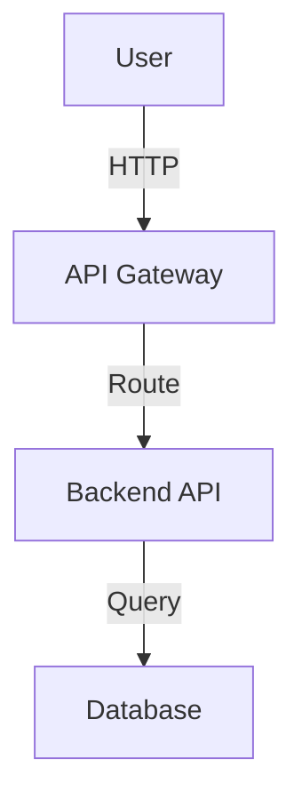

# Architecture Documentation - Implementation Guide

This directory contains comprehensive architectural documentation for the Training Tracker application, split into **Current POC Architecture** and **Recommended Enterprise Architecture**.

---

## 📁 Directory Structure

```
architecture/
├── current/                    # Current POC implementation details
│   ├── 01-system-overview.md          ✅ Complete
│   ├── 02-frontend-architecture.md    ✅ Complete
│   ├── 03-backend-architecture.md     ✅ Complete
│   ├── 04-data-architecture.md        ⏳ To be created
│   ├── 05-api-design.md               ⏳ To be created
│   ├── 06-security-architecture.md    ⏳ To be created
│   ├── 07-cross-cutting-concerns.md   ⏳ To be created
│   ├── 08-development-workflow.md     ⏳ To be created
│   ├── 09-deployment-architecture.md  ⏳ To be created
│   └── 10-limitations-tradeoffs.md    ⏳ To be created
│
└── enterprise/                 # Recommended enterprise architecture
    ├── 01-enterprise-overview.md      ✅ Complete
    ├── 02-frontend-architecture.md    ⏳ To be created
    ├── 03-backend-architecture.md     ⏳ To be created
    ├── 04-data-architecture.md        ⏳ To be created
    ├── 05-api-management.md           ⏳ To be created
    ├── 06-security-architecture.md    ⏳ To be created
    ├── 07-observability.md            ⏳ To be created
    ├── 08-resilience-ha.md            ⏳ To be created
    ├── 09-cicd-devops.md              ⏳ To be created
    ├── 10-compliance-governance.md    ⏳ To be created
    ├── 11-performance-scalability.md  ⏳ To be created
    ├── 12-cost-optimization.md        ⏳ To be created
    ├── 13-migration-strategy.md       ⏳ To be created
    └── 14-operational-runbooks.md     ⏳ To be created
```

---

## ✅ Completed Files

### Current POC Architecture
1. **System Overview** - High-level system context, technology stack, design principles
2. **Frontend Architecture** - React SPA, component hierarchy, CSS Modules, routing
3. **Backend Architecture** - ASP.NET Core API, layered architecture, middleware pipeline

### Enterprise Architecture
1. **Enterprise Overview** - Cloud deployment, security layers, NFRs, multi-region strategy

---

## 📝 Template for Remaining Files

Use this template structure when creating additional section files:

```markdown
# [Section Title] - [Current/Enterprise]

[← Back to Architecture Overview](../../ARCHITECTURE_[CURRENT_POC|ENTERPRISE_RECOMMENDED].md)

---

## Overview

[Brief description of what this section covers]

---

## [Main Topic 1]

### [Subtopic 1.1]

[Content with code examples, diagrams, tables]

### [Subtopic 1.2]

[Content]

---

## [Main Topic 2]

### [Subtopic 2.1]

[Content]

---

## Diagrams

[Use ASCII diagrams or Mermaid syntax]

\`\`\`
[Diagram code]
\`\`\`

---

## Key Decisions

| Decision | Rationale | Trade-offs |
|----------|-----------|------------|
| [Decision 1] | [Why] | [Pros/Cons] |

---

## Implementation Checklist

- [ ] Task 1
- [ ] Task 2
- [ ] Task 3

---

## References

- [Related Internal Docs]
- [External Resources]

---

**Next:** [Next Section →](./[next-file].md)
```

---

## 🎯 Content Guidance for Remaining Files

### Current POC Architecture - Remaining Sections

#### 04-data-architecture.md
**Topics to Cover:**
- Database schema design (SSDT project)
- Entity Framework Core configuration
- ADR-001 Persistence Strategy (SSDT + EF Core DML-only)
- Connection string management
- Seed data approach
- Database deployment process
- Schema drift considerations

**Reference:** `DATABASE_REFERENCE.md`, `ADR-001_Persistence_Strategy.md`

---

#### 05-api-design.md
**Topics to Cover:**
- REST API conventions (resource-based URLs, HTTP verbs)
- Endpoint structure and naming
- Request/Response DTOs
- Pagination pattern (page, pageSize, totalCount)
- Error handling and HTTP status codes
- Correlation IDs for tracing
- CORS configuration

**Reference:** `API_REFERENCE.md`

---

#### 06-security-architecture.md
**Topics to Cover:**
- Current authentication (placeholder: alice@example.com)
- Authorization model (none currently)
- CORS policy (localhost origins)
- Input validation (server-side)
- SQL injection prevention (EF Core parameterized queries)
- XSS protection (React auto-escapes)
- Future security roadmap (Azure AD, RBAC)

**Reference:** `API_REFERENCE.md` Authentication section

---

#### 07-cross-cutting-concerns.md
**Topics to Cover:**
- Logging (ILogger interface, console output)
- Correlation IDs (CorrelationIdMiddleware)
- Exception handling (ExceptionHandlingMiddleware)
- Configuration management (appsettings.json)
- Health checks (/health, /health/ready endpoints)
- Startup information tracking

**Reference:** `Program.cs`, middleware files

---

#### 08-development-workflow.md
**Topics to Cover:**
- Local development setup (prerequisites)
- Starting backend API (dotnet run)
- Starting frontend (npm run dev)
- Database deployment (SSDT publish)
- Testing approach (manual testing, PowerShell scripts)
- Debugging (VS Code, Chrome DevTools)
- Common issues and troubleshooting

**Reference:** `QUICK_START.md`, `API_STARTUP_GUIDE.md`

---

#### 09-deployment-architecture.md
**Topics to Cover:**
- Current deployment model (local only)
- Environment configuration (.env, appsettings.Development.json)
- Port assignments (5115 backend, 5174 frontend)
- LocalDB setup ((localdb)\MSSQLLocalDB)
- File structure and build artifacts
- No CI/CD pipeline (manual deployment)

**Reference:** `NEXT_STEPS.md` deployment section

---

#### 10-limitations-tradeoffs.md
**Topics to Cover:**
- POC simplifications (no auth, no tests, no caching)
- Technical debt inventory
- Security limitations (no HTTPS, no authentication)
- Scalability constraints (single instance, no load balancing)
- Missing features (no notifications, no reporting)
- Areas for improvement (prioritized list)

**Reference:** `NEXT_STEPS.md` Known Limitations

---

### Enterprise Architecture - Remaining Sections

#### 02-frontend-architecture.md (Enterprise)
**Topics to Cover:**
- Azure Static Web Apps hosting
- Global CDN distribution (Azure Front Door)
- Progressive Web App (PWA) capabilities
- Offline-first architecture (service workers)
- Performance optimization (code splitting, lazy loading)
- Bundle optimization strategies

---

#### 03-backend-architecture.md (Enterprise)
**Topics to Cover:**
- Azure App Service deployment
- Auto-scaling configuration
- Containerization with Docker (optional)
- Azure Kubernetes Service (AKS) for microservices (future)
- Service mesh patterns (Istio/Linkerd)
- Serverless functions for background jobs

---

#### 04-data-architecture.md (Enterprise)
**Topics to Cover:**
- Azure SQL Database (elastic pools, DTUs)
- Read replicas and geo-replication
- Data partitioning strategies
- Database sharding for scale
- Caching layers (Redis, CDN)
- Backup and disaster recovery (point-in-time restore, geo-restore)

---

#### 05-api-management.md
**Topics to Cover:**
- Azure API Management setup
- API versioning strategy (v1, v2 endpoints)
- Rate limiting and throttling policies
- Subscription keys and API keys
- Developer portal configuration
- API analytics and monitoring

---

#### 06-security-architecture.md (Enterprise)
**Topics to Cover:**
- Azure AD (Entra ID) integration
- OAuth 2.0 / OpenID Connect flows
- Role-based access control (RBAC) with claims
- Managed identities for Azure resources
- Azure Key Vault integration
- SSL/TLS certificates (Azure Front Door)
- DDoS Protection Standard
- Web Application Firewall (WAF) policies

---

#### 07-observability.md
**Topics to Cover:**
- Application Insights setup (instrumentation keys)
- Log Analytics workspace configuration
- Distributed tracing with correlation IDs
- Custom metrics and dashboards
- Alerting rules (metric alerts, log query alerts)
- Performance monitoring (APM)
- Synthetic monitoring (availability tests)

---

#### 08-resilience-ha.md
**Topics to Cover:**
- Multi-region deployment (Traffic Manager)
- Load balancing strategies
- Auto-scaling policies (CPU, memory, requests)
- Circuit breaker pattern (Polly library)
- Retry policies with exponential backoff
- Bulkhead isolation
- Health checks and readiness probes
- Disaster recovery planning (RTO/RPO targets)

---

#### 09-cicd-devops.md
**Topics to Cover:**
- Azure DevOps pipelines (YAML)
- Build pipeline (compile, test, package)
- Release pipeline (deploy to Dev/Staging/Prod)
- Infrastructure as Code (Terraform/Bicep)
- Automated testing (unit, integration, E2E)
- Blue-green deployments
- Canary releases (gradual rollout)
- Feature flags (LaunchDarkly, Azure App Configuration)

---

#### 10-compliance-governance.md
**Topics to Cover:**
- Data residency requirements
- GDPR compliance (consent, right to erasure, data portability)
- SOC 2 / ISO 27001 considerations
- Audit logging (Log Analytics)
- Data retention policies
- Privacy by design principles
- Compliance monitoring dashboards

---

#### 11-performance-scalability.md
**Topics to Cover:**
- Performance benchmarks (p50, p95, p99)
- Load testing strategy (JMeter, k6)
- Scalability patterns (horizontal vs vertical)
- Caching strategies (L1: in-memory, L2: Redis, L3: CDN)
- Database optimization (indexing, query tuning)
- Connection pooling
- Async/await patterns
- Response compression (gzip, brotli)

---

#### 12-cost-optimization.md
**Topics to Cover:**
- Azure cost management tools
- Right-sizing resources (compute, storage, database)
- Reserved instances vs pay-as-you-go
- Cost allocation and chargeback (tagging strategy)
- Resource lifecycle management
- Auto-scaling for cost optimization
- Budget alerts and spending limits

---

#### 13-migration-strategy.md
**Topics to Cover:**
- Phased migration approach (4-6 phases)
- POC to staging transition checklist
- Staging to production cutover plan
- Data migration strategies (export/import, replication)
- Rollback plans and procedures
- User training and change management
- Communication plan for stakeholders

---

#### 14-operational-runbooks.md
**Topics to Cover:**
- Deployment procedures (step-by-step)
- Incident response playbooks (P1, P2, P3 incidents)
- Scaling operations (manual and automated)
- Backup and restore procedures
- Security incident response
- Database maintenance (index rebuild, statistics update)
- Certificate renewal procedures
- Failover testing procedures

---

## 🔗 Cross-References

Ensure each section file includes:
- **Navigation:** Links to master document and adjacent sections
- **References:** Links to related internal documentation
- **External Links:** Official Microsoft/Azure documentation

---

## 📊 Diagram Standards

### Use ASCII Diagrams for Simple Flows

```
┌─────────────┐
│   Client    │
└──────┬──────┘
       │
       ▼
┌─────────────┐
│   Server    │
└─────────────┘
```

### Use Mermaid for Complex Diagrams (Future)

````markdown

````

---

## ✍️ Contribution Guidelines

When adding new section files:

1. **Follow the template** structure above
2. **Use consistent formatting** (headings, tables, code blocks)
3. **Include practical examples** (code snippets, configuration samples)
4. **Add diagrams** for complex concepts
5. **Link to related documentation** (internal and external)
6. **Keep sections focused** (single responsibility per file)
7. **Update master document** with links to new sections
8. **Update this README** to mark sections as complete

---

## 📚 Reference Documents

### Internal Documentation
- [API Reference](../API_REFERENCE.md) - Complete REST API documentation
- [UI Components Reference](../UI_COMPONENTS_REFERENCE.md) - Frontend component documentation
- [Database Reference](../DATABASE_REFERENCE.md) - Database schema documentation
- [Next Steps](../NEXT_STEPS.md) - Feature roadmap and progress tracking
- [ADR-001](../ADR-001_Persistence_Strategy.md) - Persistence architecture decision

### External Resources
- [Azure Architecture Center](https://learn.microsoft.com/en-us/azure/architecture/)
- [ASP.NET Core Documentation](https://learn.microsoft.com/en-us/aspnet/core/)
- [React Documentation](https://react.dev/)
- [C4 Model for Architecture](https://c4model.com/)

---

## 🎯 Next Steps

1. **Immediate:** Create remaining Current POC section files (04-10)
2. **Short-term:** Create remaining Enterprise section files (02-14)
3. **Ongoing:** Keep documentation in sync with code changes
4. **Future:** Add Mermaid diagrams for better visualization

---

## 📝 Document Version

| Date | Change | Author |
|------|--------|--------|
| 2025-10-09 | Initial architecture documentation structure created | System |
| 2025-10-09 | Completed 4 section files (3 current, 1 enterprise) | System |

---

**Questions or suggestions?** Update [NEXT_STEPS.md](../NEXT_STEPS.md) with architectural improvements.
